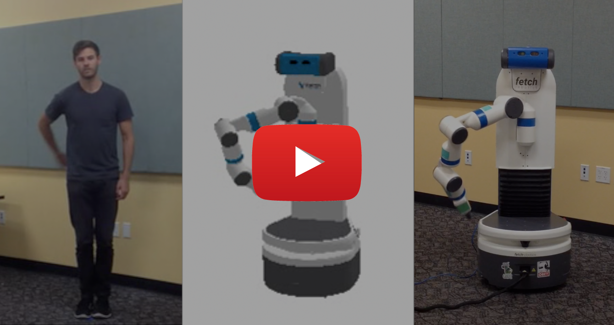

# Time-Contrastive Networks:<br> Self-Supervised Learning from Multi-View Observation
### Pierre Sermanet\*, Corey Lynch\*\†, Jasmine Hsu, Sergey Levine
(* equal contributions, † Google Brain Residency program g.co/brainresidency)

### [[Paper]](https://arxiv.org/abs/1704.06888) [[Video]](https://www.youtube.com/watch?v=sErz1jyhTXk)

<a href="http://www.youtube.com/watch?feature=player_embedded&v=sErz1jyhTXk" target="_blank">
 
</a>

# Unsupervised Objects Interactions

### Training Sequences


### Semantic Alignment / Nearest Neighbor Imitation


### 'Fake' pouring imitation


### Imitation Errors


### Robotic Imitation (end-effector never seen during training)


# End-to-End Self-Supervised Pose Imitation

### Self-supervised only (no labels)


### Complex non-linear mapping discovered unsupervised


### Imitation Failures (shoulder joint)


### Self-supervision + human supervision


# Citation

```
@article{TCN2017,
  title={Time-Contrastive Networks: Self-Supervised Learning from Multi-View Observation},
  author={Sermanet, Pierre and Lynch, Corey and Hsu, Jasmine and Levine, Sergey},
  journal={arXiv preprint arXiv:1704.06888},
  year={2017}
}
```

# Acknowledgments

We thank Jonathan Tompson, James Davidson and Vincent Vanhoucke for helpful discussions and feedback. We are also grateful to Eric Jang and Phing Lee for their repeated help and talent in robot imitation. Finally we thank everyone else who provided imitations for this project: Alexander Toshev, Anna Goldie, Deanna Chen, Deirdre Quillen, Dieterich Lawson, Eric Langlois, Ethan Holly, Irwan Bello, Jasmine Collins, Jeff Dean, Julian Ibarz, Ken Oslund, Laura Downs, Leslie Phillips, Luke Metz, Mike Schuster, Ryan Dahl, Sam Schoenholz and Yifei Feng.
